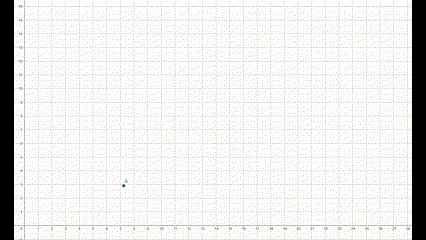
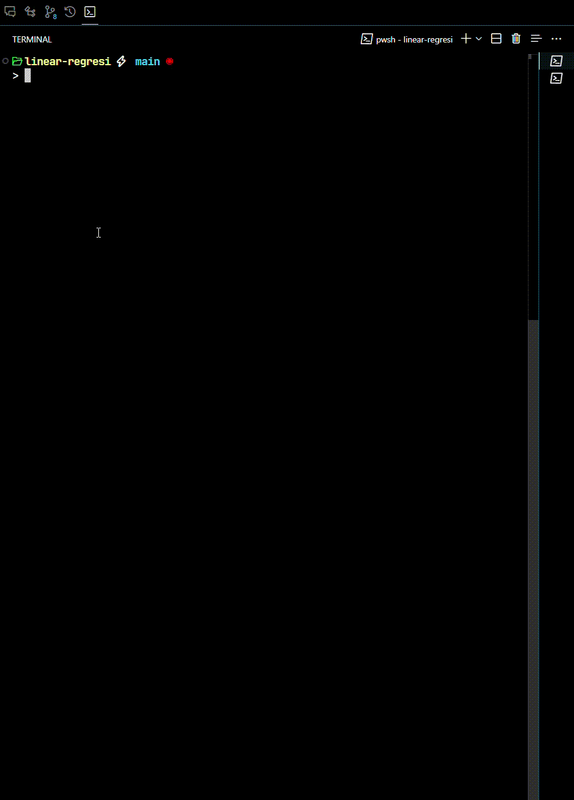

#  JavaScript Linear Regression

Ini adalah percobaan implementasi model regresi linear pada program komputer. Program dibuat dengan bahasa pemrograman JavaScript dan dengan *runtime* [Node.js](https://nodejs.org/) dengan tanpa menggunakan bantuan library atau framework pembantu perhitungan matematis. Program yang dibuat ada dua versi, CLI (*Command Line Interface*) dan juga website.

<div align="center">
    
</div>


# Menjalankan program 🛩️
    
1. Install dependensi yang dibutuhkan

    Pastikan perangkat anda sudah terinstall [Node.js](https://nodejs.org/). Jika sudah, maka lakukan perintah berikut pada terminal perangkat anda:
    ```shell
    npm install
    ```

2. Jalankan program di terminal

    Gunakan perintah berikut:
    ```shell
    npm run cli
    ```

# Preview program 🤖

Berikut adalah contoh ketika program dijalankan:




# Kustomisasi 🛠️

Anda bisa melakukan kustomisasi pada proyek ini. Kustomisasi bisa dilakukan pada data yang digunakan ataupun alur kerja program. Jika anda ingin melakukan kustomisasi data, maka anda bisa ubah file `.csv` pada folder [`data/`](data/). 

# Kontribusi 🫱🏻‍🫲🏻

Anda bisa melakukan kontribusi pada proyek ini dengan melakukan *fork* pada repositori ini dan unggah perubahan yang anda lakukan ke GitHub. Kemudian Anda bisa mengajukan *pull request* ke repositori ini. Untuk petunjuk lebih lanjut, anda bisa membaca dokumentasi dari GitHub berikut: https://docs.github.com/en/get-started/exploring-projects-on-github/contributing-to-a-project

Anda juga bisa mengajukan kritik atau saran dengan membuka [*issue*]() di repositori ini.

# Penutup 🍃

Demikian proyek sederhana yang dibuat dengan tujuan melakukan demonstrasi regresi linear menggunakan bahasa pemrograman JavaScript dan *runtime* Node.js. Proyek ini juga bisa menjadi acuan dalam pembelajaran terkait model-model *machine learning* yang lebih kompleks. 

Akhir kata, terima kasih 🙏🏻

# Referensi 📃

- [**"The Elements of Statistical Learning"** by Trevor Hastie, Robert Tibshirani, and Jerome Friedman](https://www.sas.upenn.edu/~fdiebold/NoHesitations/BookAdvanced.pdf)
- [**"Mathematics for Machine Learning" by Marc Peter Deisenroth, A. Aldo Faisal, Cheng Soon Ong**](https://mml-book.github.io/)

# Lihat juga 👁️

- [**Linear Regression, Clearly Explained**: Youtube video by StatQuest with Josh Starmer](https://youtu.be/nk2CQITm_eo?si=CyoCEtAnBETJYT3E)

---
---